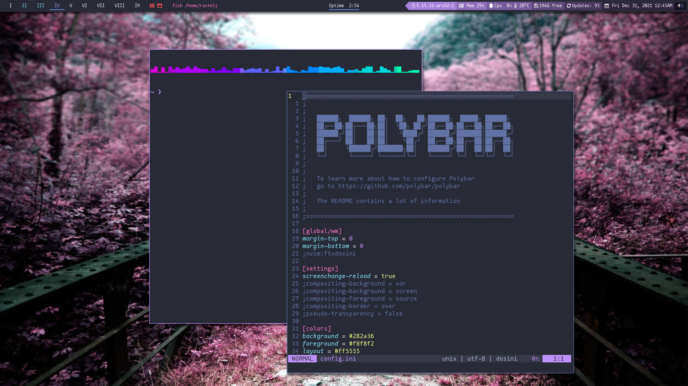

# GLR-ST



[st](https://st.suckless.org/) is a simple terminal implementation for X developed by [suckless](https://suckless.org/).

## My build

st is very minimal, so I've patched it to make it useful for me. These are all the patches I have included so far:

- blinking cursor - this patch allows the use of a blinking cursor
- clipboard - allows st to set to clipboard on selection
- default font size - this lets you spawn a terminal with a larger font size without specifying a font
- dracula - this patch make the Dracula color scheme available for st
- dynamic cursor - swaps the colors of your cursor and the character you're currently on
- font2 - This patch allows to add spare font besides default
- right click paste - pressing right-click pastes from the primary-selection
- scrollback - scroll back through terminal output using Shift+{PageUp, PageDown}
- scrollback mouse - scroll back through terminal output using Shift+MouseWheel
- scrollback mouse altscreen - scroll back through terminal output using MouseWheel (no Shift)

### New options

- -z size (font size)

You can clone this repository or simply download the `PKGBUILD` file.\
Either way, make sure you're in the same directory as the `PKGBUILD` file and run:

```bash
makepkg -cf
```

This will create a pkg.tar.zst file. Install it running this command:

```bash
sudo pacman -U name-of-package.pkg.tar.zst
```

## Installing glr-st on other distributions

Clone this repository:

```bash
git clone https://gitlab.com/glr01/glr-st.git
```

Then run:

```bash
cd glr-st
sudo make clean install
```

---

> glr-st conflicts with standard st. Make sure to backup your existing st as this will overwirte it.

